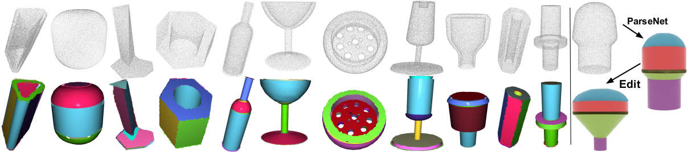

## ParSeNet: A Parametric Surface Fitting Network for 3D Point Clouds
*Authors: [Gopal Sharma](https://hippogriff.github.io/), [Difan Liu](https://people.cs.umass.edu/~dliu/), [Evangelos Kalogerakis](https://people.cs.umass.edu/~kalo/), [Subhransu Maji](https://people.cs.umass.edu/~smaji/), [Siddhartha Chaudhuri](https://www.cse.iitb.ac.in/~sidch/), [Radomír Měch](https://research.adobe.com/person/radomir-mech/)*

This repository contains codebase for the ParSeNet paper published at ECCV-2020.

[Paper](https://arxiv.org/pdf/2003.12181.pdf) | [Project Page](https://hippogriff.github.io/parsenet/)




### Installation

To install conda environment:

```bash
conda env create --force environment.yml -n parsenet
source activate parsenet
```

------


### Dataset

To dowload the dataset, run:

```bash
bash download_dataset.sh
```
For data organization, please see `readme_data.md`.

------


### Experiments

Experiments are done on Nvidia 1080ti gpus.

#### SplineNet

* To train open SplineNet (with 2 gpus):

```python
python train_open_splines.py configs/config_open_splines.yml
```

* To test open SplineNet:

```python
python test_open_splines.py configs/config_test_open_splines.yml
```

* To train closed SplineNet (with 2 gpus):

```python
python train_closed_control_points.py configs/config_closed_splines.yml
```

* To test closed SplineNet:

```python
python test_closed_control_points.py configs/config_test_closed_splines.yml
```


#### ParSeNet

- To train ParseNet with only points as input (with 4 gpus):

```
python train_parsenet.py configs/config_parsenet.yml
```

* To train ParseNet with points and normals as input (with 4 gpus):

```
python train_parsenet.py configs/config_parsenet_normals.yml
```

* To train ParseNet in an end to end manner (note that you need to first pretrain the above models), then specify the path to the trained model in `configs/config_parsenet_e2e.yml` (with 2 gpus). Further note that, this part of the training requires dynamic amount of gpu memory because a shape can have variable number of segment and corresponding number of fitting module. Training is done using Nvidia m40 (24 Gb gpu).

```
python train_parsenet_e2e.py  configs/config_parsenet_e2e.yml
```

* Testing can be done using `test.py`
```
python test.py 0 3998
```
------


### Acknowledgements

1. This project takes inspiration of designing network architecture from the code base provided by Wang et.al.: https://github.com/WangYueFt/dgcnn
2. We also thank Sebastian for timely release and advice on ABC dataset: https://deep-geometry.github.io/abc-dataset/

------


### Citation

```
@misc{sharma2020parsenet,
    title={ParSeNet: A Parametric Surface Fitting Network for 3D Point Clouds},
    author={Gopal Sharma and Difan Liu and Evangelos Kalogerakis and Subhransu Maji and Siddhartha Chaudhuri and Radomír Měch},
    year={2020},
    eprint={2003.12181},
    archivePrefix={arXiv},
    primaryClass={cs.CV}
}
```
